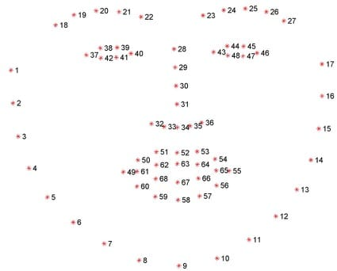
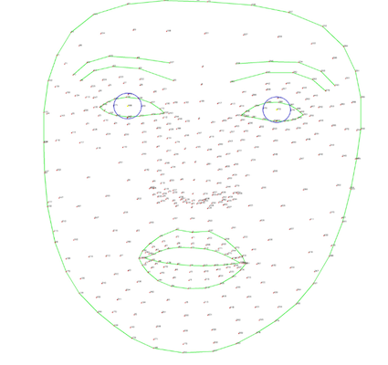

# Face Alignment Tool

A Python-based tool for automatically detecting and aligning faces in images using facial landmarks.

## Setup

This was tested on Python 3.12 only.
Recommended to use [uv](https://docs.astral.sh/uv/) for easy setup.

## Usage

```
usage: face_align.py [-h] [--size SIZE] [--engine {dlib,mediapipe}] [--debug] [--refine] [--max-faces MAX_FACES] input_path [output_path]

Align faces in images

positional arguments:
  input_path            Path to input image file or directory
  output_path           Path to output image file or directory (optional)

options:
  -h, --help            show this help message and exit
  --size SIZE           Output image size (default: 1024)
  --engine {dlib,mediapipe}
                        Face detection engine to use (default: mediapipe)
  --debug               Show facial landmarks in the output image
  --refine              Enable refined landmarks in MediaPipe (provides 478 landmarks instead of 468)
  --max-faces MAX_FACES
                        Maximum number of faces to process per image (default: 3, use 1 for single face only)
```

## Face Landmarks

This tool uses face landmark detectors which basically maps human faces in images to points at well defined landmarks, for example the position of the right corner of a mouth.

The simplest engine is dlib and can detect 68 face landmarks in 2D space. The more advanced engine is mediapipe and can detect 468 face landmarks in 3D space, effectively estabilishing a 3D mesh of a face.

These will yield slightly different result but not by much. I am not sure how to measure the accuracy of those detectors, it does looks good in both cases.



*dlib 68 face landmarks*



*mediapipe 468 face landmarks*