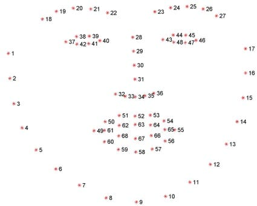

# Face Alignment Tool

A Python-based tool for automatically detecting and aligning faces in images using facial landmarks.

## Usage

```
usage: main.py [-h] [--size SIZE] input_image

Align faces in images

positional arguments:
  input_image  Path to input image file

options:
  -h, --help   show this help message and exit
  --size SIZE  Output image size (default: 1024)
```

## Setup

```bash
conda env create -f environment.yml
conda activate face-align
```

## Face Landmarks

The tool uses a 68 face landmarks detector model. The left eye landmarks (37 to 42), the right eye landmarks (43 to 48) and the outer mouth landmarks (49 to 60) are used to compute a mean position for each of those area and finally determine the ideal rotated crop rectangle.

